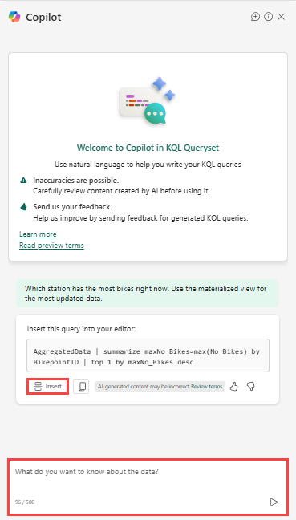

# Real-Time Intelligence tutorial part 4: Query streaming data using KQL

In this part of the tutorial, you query streaming data using a few different methods. You write a KQL query to visualize data in a time chart and you create an aggregation query using a materialized view. You also query data by using T-SQL and by using **explain** to convert SQL to KQL. Finally, you use Copilot to generate a KQL query.

## Write a KQL query

The name of the table you created in a previous step is _TransformedData_. Use this (case-sensitive) name as the data source for your query.

1. Create a new query editor and enter the following query. Then press **Shift + Enter** to run the query.

     ```kusto
    TransformedData 
    | where BikepointID > 100 and Neighbourhood == "Chelsea" 
    | project Timestamp, No_Bikes 
    | render timechart
    ```

    This query creates a time chart that shows the number of bikes in the Chelsea neighborhood as a time chart. Note that the visual output may vary based on the real-time data available.

    

## Create a materialized view

In this step, you create a materialized view, which returns an up-to-date result of the aggregation query (always fresh). Querying a materialized view is more performant than running the aggregation directly over the source table.

1. Copy/paste and run the following command to create a materialized view that shows the most recent number of bikes at each bike station:

    ``` kusto
    .create-or-alter materialized-view with (folder="Gold") AggregatedData on table TransformedData {
        TransformedData 
        | summarize arg_max(Timestamp, No_Bikes) by BikepointID
    }
    ```

2. Copy/paste and run the following query to see the data in the materialized view visualized as a column chart:

    ```kusto
    AggregatedData 
    | sort by BikepointID 
    | render columnchart with (ycolumns=No_Bikes, xcolumn=BikepointID)
    ```

You will use this query in the next step to create a Real-Time dashboard.

> [!IMPORTANT]
> If you have missed any of the steps used to create the tables, update policy, function, or materialized views, use this script to create all required resources: [Tutorial commands script](https://github.com/microsoft/fabric-samples/blob/main/docs-samples/real-time-intelligence/tutorial-commands-script.kql).

## Query using T-SQL

The query editor supports the use of T-SQL.

- Enter the following query, and then press **Shift + Enter** to run the query.

    ```kusto
    SELECT top(10) *
    FROM AggregatedData
    ORDER BY No_Bikes DESC
    ```

This query returns the top 10 bike stations with the most bikes, sorted in descending order.

## Convert a SQL query to KQL

To get the equivalent KQL for a T-SQL SELECT statement, add the keyword `explain` before the query. The output shows the KQL version of the query, which you can copy and run in the KQL query editor.

- Enter the following query. Then press **Shift + Enter** to run the query.

    ```kusto
    explain
    SELECT top(10) *
    FROM AggregatedData
    ORDER BY No_Bikes DESC
    ```

This query returns a KQL equivalent of the T-SQL query you enter. The KQL query appears in the output pane. Try copying and pasting the output, and then run the query. This query might not be written in optimized KQL.

## Use Copilot to generate a KQL query

If you're new to writing KQL, you can ask a question in natural language and Copilot generates the KQL query for you.

1. In the KQL queryset, select the **Copilot** icon from the menu bar.

2. Enter a question in natural language. For example, "Which station has the most bikes right now. Use the materialized view for the most updated data." It can help to include the name of the materialized view in your question.

    The Copilot suggests a query based on your question.

3. Select the **Insert** button to add the query to the KQL editor.

    

4. Select **Run** to run the query.

Ask follow-up questions or change the scope of your query. Use this feature to learn KQL and generate queries quickly.

## Next step

> Select **Next >** to create a Real-Time dashboard.
