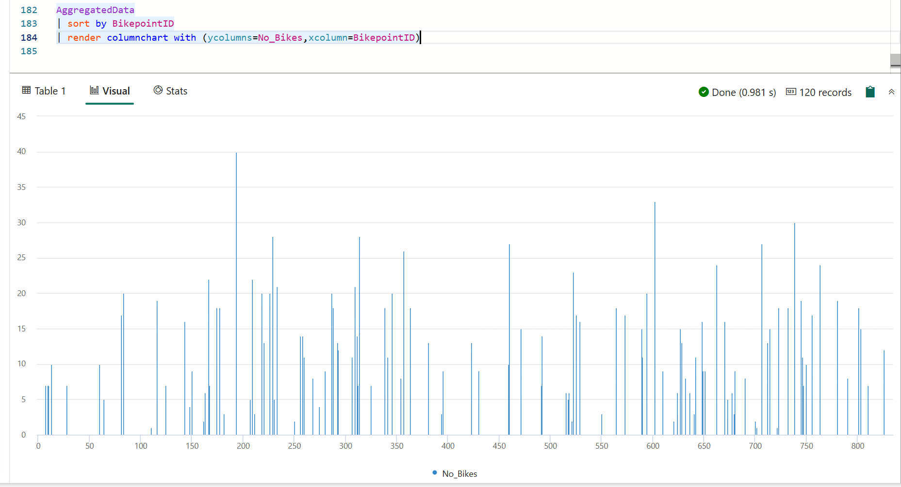
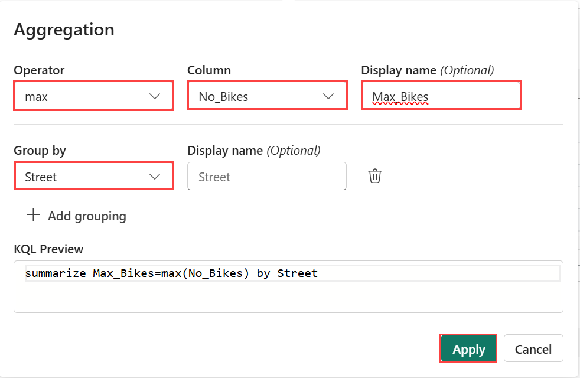

# Real-Time Intelligence tutorial part 5: Create a Real-Time dashboard

In this part of the tutorial, you learn how to create a Real-Time Dashboard in Real-Time Intelligence. You create a Kusto Query Language (KQL) query, create a Real-Time Dashboard, add a new tile to the dashboard, and explore the data visually by adding an aggregation.

## Create a Real-Time dashboard

1. In your KQL queryset, copy/paste, and run the following query. This query might already have been run from the previous section in this tutorial. This query returns a column chart showing the most recent number of bikes by *BikepointID*.

    ```kusto
    AggregatedData 
    | sort by BikepointID 
    | render columnchart with (ycolumns=No_Bikes, xcolumn=BikepointID)
    ```

    

2. Select **Save to dashboard**.
3. Enter the following information:

    

    | Field | Value |
    | --- | --- |
    | **Create new tile** | *In a new dashboard* |
    | **Dashboard name** | +++*TutorialDashboard*+++ |
    | **Tile name** | +++*Recent bikes by Timepoint*+++ |
    | **Open dashboard after creation** | *Selected* |

4. Select **Create**.

Since you've selected **Open dashboard after creation**, the new Real-Time dashboard, *TutorialDashboard*, opens with the *Recent bikes by Bikepoint* tile. You can also access the Real-Time dashboard by browsing to your workspace and selecting the desired item.

## Add a new tile to the dashboard

1. On the top menu bar, toggle from **Viewing** mode to **Editing** mode.
2. Select **New tile**

    

3. In the query editor enter the following query:

    ```kusto
    RawData 
    | where Neighbourhood == "Chelsea"
    ```

4. From the menu ribbon Select **Apply changes**.
5. This creates a new tile, rename the tile by selecting the **More menu [...]** on the top right corner of the tile, select **Tile options** and select **Rename**.
6. Rename the tile to +++*Chelsea bikes*+++.

## Explore the data visually by adding an aggregation

1. On the new **Chelsea bikes** tile, select the **Explore** icon. 
2. Select **+ Add** > **Aggregation**.
3. Select **Operator** > **max** and **Column** > *No_Bikes*.
4. Under **Display Name**, enter +++*Max_Bikes*+++.
5. Select **+ Add grouping**.
6. Select **Group by** > *Street*.
7. Select **Apply**.

    

    Notice that the query elements are updated to include the **max(No_Bikes) by Street** aggregation. The resulting table changed to show the total count of bike locations by street.

8. Change the *Visual type* by selecting **Bar chart** from the **Visualization** dropdown on the top left in the menu ribbon.
9. Select **Save to dashboard** > **In this dashboard**.
10. Enter +++**Max no. of bikes at each street**+++ as the **Tile name**.

    

11. Save the dashboard by selecting the **Save** icon on the top left corner of the dashboard.

## Next step

> Select **Next >** to set an alert on your event stream
