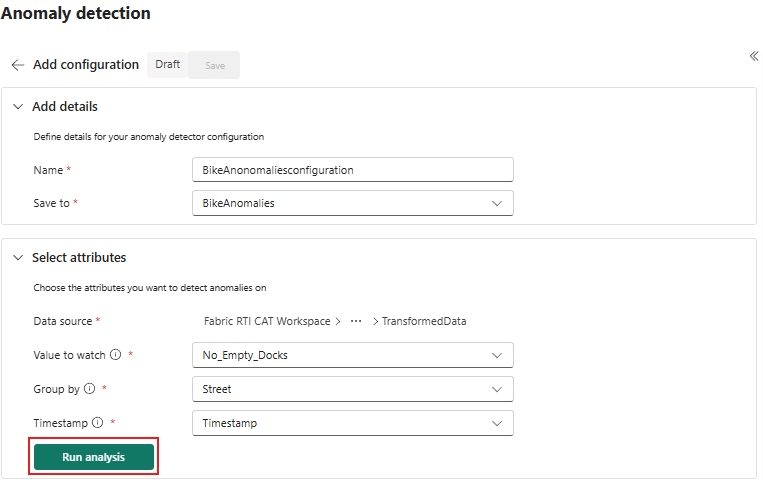

# Real-Time Intelligence tutorial part 7: create anomaly detection on your data

Anomaly detection is a feature of Real-Time Intelligence that allows you to identify unusual patterns in your data. In this part of the tutorial, you learn how to create an 'Anomaly detector' item on your workspace to detect anomalies in the number of empty docks at a station.

## Detect anomalies on an Eventhouse table

1. From the left navigation bar, select **Real-Time** to open the *Real-Time hub*.
2. Under **All data streams** select the eventhouse table **TransformedData** you created in the previous tutorial. The table details page opens. Select **Detect anomalies** from the top menu.

    

3. Enter **BikeAnomaliesconfiguration** as Name
4. Under Save to, select the workspace in which you want to create the anomaly detector item, enter a name such as **BikeAnomalies**. Then select **Create**.
5. In the 'Select attributes' section, choose the following options:

    | Field | Value |
    | --- | --- |
    | Value to watch | No_Empty_Docks |
    | Group by | Street|
    | Timestamp | Timestamp |  

    

5. Select **Run analysis**.

> [!IMPORTANT]
> Analysis typically takes up to 4 minutes depending on your data size and can run for up to 30 minutes. You can navigate away from the page and check back in when the analysis is complete.

> [!NOTE]
> Ensure your Eventhouse table contains sufficient historical data to improve model recommendations and anomaly detection accuracy. For example, datasets with one data point per day require a few months of data, while datasets with one data point per second might only need a few days.

6. When analysis is complete, anomalies along with tabular data are displayed on the right. 

    

> [!NOTE]
> Play around with the **Detection model** under **Customize detection** section and Timestamp above the **Detector results** pane. More data might increase anomaly detection accuracy.

7. Select **Save**

## Next step

> Select **Next >** to clean up resources
