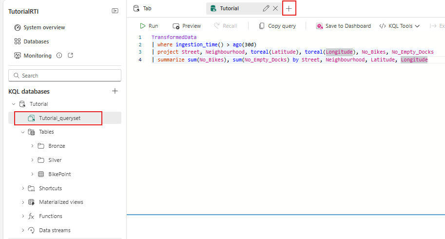
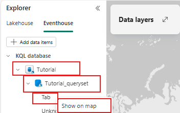
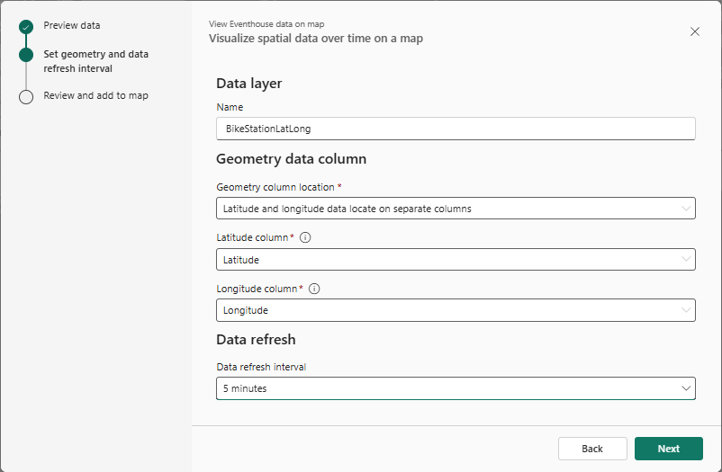
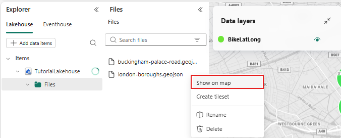
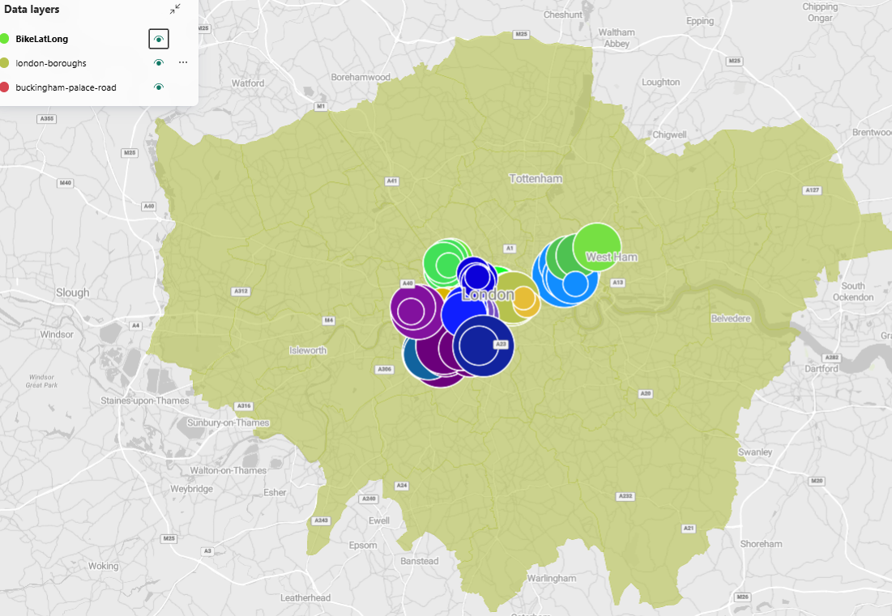
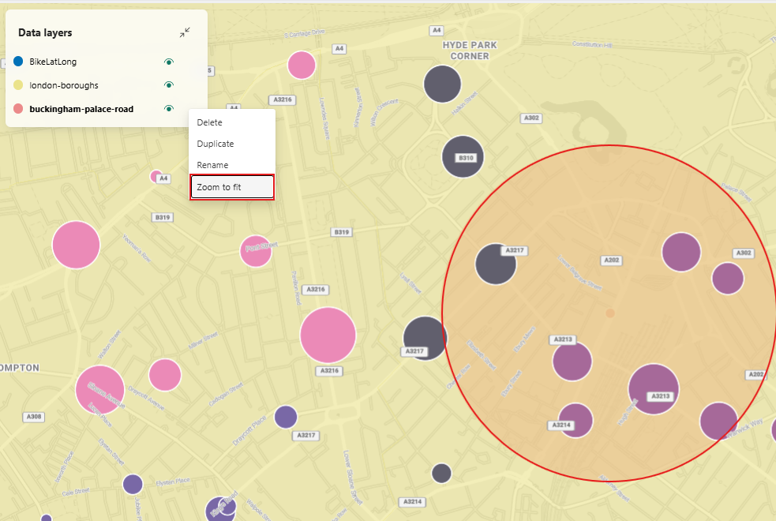

# Real-Time Intelligence tutorial part 8: create map

In this part of the tutorial, you learn how to create a map using geospatial data.

## Create KQL Queryset tab used by Map

1. Open the **Tutorial** eventhouse that you created in the previous part of the tutorial.
2. Select the **Tutorial_queryset**, open a new query tab and paste the following query.

    ```kusto
    TransformedData
    | where ingestion_time() > ago(30d)
    | project Street, Neighbourhood, toreal(Latitude), toreal(Longitude), No_Bikes, No_Empty_Docks
    | summarize sum(No_Bikes), sum(No_Empty_Docks) by Street, Neighbourhood, Latitude, Longitude
    ```
    


## Create a Lakehouse and upload GeoJson files

1. Browse to the workspace and in upper left corner select the **+ New item** button. Then search for and select **Lakehouse**.


2. Enter **TutorialLakehouse** as Name
3. Right-click the **File** node and under **Upload**, select **Upload files**.
4. Download the following two GeoJSON files from media section and upload them to the Lakehouse.
    - london-boroughs.geojson
    - buckingham-palace-road.json


## Create a Map

1. Browse to the workspace and in upper left corner select the **+ New item** button. Then search for and select **Map**.


2. Enter **TutorialMap** as Name

## Add Eventhouse data to the Map

1. In the **Explorer** pane, select **Eventhouse** and select **+ Add data items** and choose the **Tutorial** eventhouse.
2. Under Tutorial, select the **Tutorial_queryset** and right-click on the tab and select **Show on map**



3. A new window showing data preview of the query opens. Click **Next** and enter **BikeLatLong** as Name. Select the **Latitude** and **Longitude** columns. Under **Data refresh interval** select 5 minutes. Click **Next**.



4. In the next screen, click **Add to map**.
5. Right-click on **BikeLatLong** under **Data layers** and select **Zoom to fit** to zoom into London area showing bike stations on the map.
6. Under General settings, add Street and Neighbourhood under Tooltips.
7. Under Point settings, toggle **Enable series group** and select **Neighbourhood**, change **Size** to **By data** and select **sum_No_Empty_Docks**. This should immediately take effect on the map with bubble sizes representing the number of empty docks and colors representing different neighbourhoods.


## Add GeoJSON files from Lakehouse to the Map

1. In the **Explorer** pane, select **Lakehouse** and select **+ Add data items** and choose the **TutorialLakehouse** lakehouse.
2. Under TutorialLakehouse, select the **london-boroughs.geojson** file and right-click on the file and select **Show on map**. Repeat the step for **buckingham-palace-road.json** file.



3. We should see the borough boundaries and Buckingham Palace road on the map. You can toggle visibility of each layer by clicking the eye icon next to each layer under **Data layers**.



4. Right-click on **buckingham-palace-road** under **Data layers** and select **Zoom to fit** to zoom into Buckingham Palace road area on the map.



7. Select **Save**

## Next step

> Select **Next >** to clean up resources
